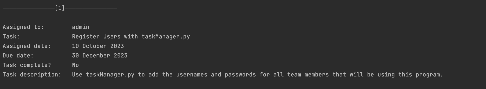

# Task Manager 

Task manager is a program on Python language for a small businesses that can help them to manage tasks assigned to each member of the team. 

## List of Contents
1. Description 
2. Dependencies
3. Installing
4. Usage 
5. Authors

## (1) Description

Key features:
* login section
* register a new user
* add a new task
* view all tasks
* view task of the particular user
* modify the tasks
* generate reports
* generate statistics (eg.. completed, uncompleted and overdue tasks)

## (2) Dependencies

OS version: macOS (eg.. Monterey version 12.6.1), Windows 10

Python libraries: os.path, datetime

## (3) Installing

To run this application, you'll need Python 3.11.1 and PyCharm or VS Code installed on your computer.

This program works with two text files: user.txt and tasks.txt. To be able to run the program these two files with data are required.

* tasks.txt stores a list of all the tasks that the team is working on

* user.txt stores the username and password for each user that has permission to use the program 


## (4) Usage
Once everything required is installed, you can run the code to start the application.

The program has login section and any user should log in first. It has 2 levels and different functionality for admin user (level 1) and for other registered users (level 2). 

1. Admin menu 

The admin user is provided with a wider functionality in the menu. The following menu should be displayed once the admin user has successfully logged in: 

In 'r' menu option admin is allowed to register a new user. 

In 'a' menu option admin is able to add a task to existing or new users.

In 'va' menu option all tasks of all users presented. Please find the example below:

In 'vm' menu option admin tasks are displayed. The admin user is able to select either a specific task (by entering a number) or input ‘-1’ to return to the main menu. 

If the user select a specific task, they are able to choose to either mark the task as complete or edit the task. Please find the example below:

When the user chooses to generate reports or 'gr' menu option, two text files, called task_overview.txt and user_overview.txt, are generated. Please find the example of the information in the report:

Also, the admin user is provided with a menu option that allows to display different statistics about all tasks and users. Please find the example of the statistics below:

2. General users' menu

The following menu should be displayed once the user has successfully logged in: 


## (5) Authors

Iaroslava Gorbunenko

